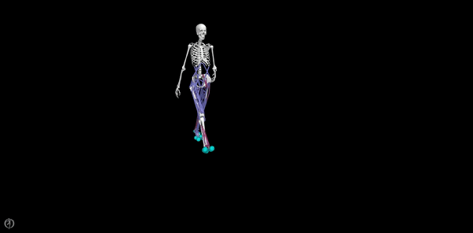

# Tutorial: 3D Predictive Simulations of Walking

This tutorial aims to guide users through the steps required to generate 3D predictive simulations of walking while leveraging [OpenSimAD](https://github.com/antoinefalisse/opensimAD). OpenSimAD is a custom version of OpenSim that supports algorithmic differentiation.

The generated predictive simulations should look like this:

  

# Setup conda environment
1. Install [Anaconda](https://www.anaconda.com/)
2. Open Anaconda prompt
3. Create environment (python 3.9 recommended): `conda create -n predsim_tutorial python=3.9`
4. Activate environment: `conda activate predsim_tutorial`
5. Install OpenSim: `conda install -c opensim-org opensim=4.4=py39np120`
	- Test that OpenSim was successfully installed:
		- Start python: `python`
		- Import OpenSim: `import opensim`
			- If you don't get any error message at this point, you should be good to go.
		- You can also double check which version you installed : `opensim.GetVersion()`
		- Exit python: `quit()`
	- Visit this [webpage](https://simtk-confluence.stanford.edu:8443/display/OpenSim/Conda+Package) for more details about the OpenSim conda package.
6. (Optional): Install an IDE such as Spyder: `conda install spyder`
7. Clone the repository to your machine: 
	- Navigate to the directory where you want to download the code: eg. `cd ./Documents`.
	- Clone the repository: `git clone https://github.com/antoinefalisse/predsim_tutorial.git`
	- Navigate to the directory: `cd predsim_tutorial`
8. Install required packages: `python -m pip install -r requirements.txt`

# Tutorial
## Part 1: Generate external function
(You can skip to part 2 if you are only interested in the simulation part, the outputs from part 1 are already available).

To leverage the benefits of algorithmic differentiation, we use [CasADi external functions](https://web.casadi.org/docs/#casadi-s-external-function). In our case, the external functions typically take as inputs the multi-body model states (joint positions and speeds) and controls (joint accelerations) and return the joint torques after solving inverse dynamics. To generate the external function, we will need our OpenSim musculoskeletal model and we will use [OpenSimAD](https://github.com/antoinefalisse/opensimAD). In this tutorial, the OpenSim model we will use is a scaled version of the Hamner model, you can find it here: /Documents/predsim_tutorial/OpenSimModel/Hamner_modified/Model/Hamner_modified_scaled.osim. Let's first generate the external function corresponding to this model.
1. Install [OpenSimAD](https://github.com/antoinefalisse/opensimAD) following the instructions in the [README](https://github.com/antoinefalisse/opensimAD#install-requirements). We will assume you downloaded the repository under /Documents/opensimAD.
2. Copy the scaled musculoskeletal model (Hamner_modified_scaled.osim) in /Documents/opensimAD/examples (fyi there should already be two example models in that folder).
3. In /Documents/opensimAD/main.py, adjust [`modelName`](https://github.com/antoinefalisse/opensimAD/blob/main/main.py#L46) to the name of your scaled model: `modelName = 'Hamner_modified'`.
4. Run `main.py` (make sure you activated the opensim-ad conda environment). You should see some new files in /Documents/opensimAD/examples. Among them, the following three files: `Hamner_modified_scaled.cpp`, `Hamner_modified_scaled.npy`, and `Hamner_modified_scaled.dll` (Windows) or `Hamner_modified_scaled.so` (Linux) or `Hamner_modified_scaled.dylib` (macOS).
5. Create a folder ExternalFunction in /Documents/predsim_tutorial/OpenSimModel/Hamner_modified/Model/ and copy the three files mentioned above in this new folder (yes they are already there in case you wanted to skip part 1, but now you know how to generate these files). It should like:
	- /Documents/predsim_tutorial/OpenSimModel/Hamner_modified/Model/ExternalFunction/Hamner_modified_scaled.cpp
	- /Documents/predsim_tutorial/OpenSimModel/Hamner_modified/Model/ExternalFunction/Hamner_modified_scaled.npy
	- /Documents/predsim_tutorial/OpenSimModel/Hamner_modified/Model/ExternalFunction/Hamner_modified_scaled.dll(so or dylib)

## Part 2: Generate simulations

# Overview of main files:
- `main.py`: basically everything from loading data, formulating the problem, solving it, and processing the results. Yes I know, it is not fantastic pratice to have everything in one place. Case 0 ([default](https://github.com/antoinefalisse/predsim_tutorial/blob/main/main.py#L51)) converges in 704 iterations on my windows machine. 
- `plotResults.py`: plots of simulation results against reference data (eg, joint angles and torques, ground reaction forces, and muscle activations).
- The other files are mainly containing classes and functions called in `main.py`.

# Visualize simulations in OpenSim
- Launch OpenSim
- Open model, eg `OpenSimModel/Hamner_modified/Model/Hamner_modified_scaled.osim`
- Load motion, eg `Results/Case_0/motion.mot`
- Associate Motion Data, eg `Results/Case_0/GRF.mot`

# Citation
Please cite this paper:
  - Falisse A, Afschrift M, De Groote F (2022) _Modeling toes contributes to realistic stance knee mechanics in three-dimensional predictive simulations of walking_. PLoS ONE 17(1): e0256311. https://doi.org/10.1371/journal.pone.0256311
